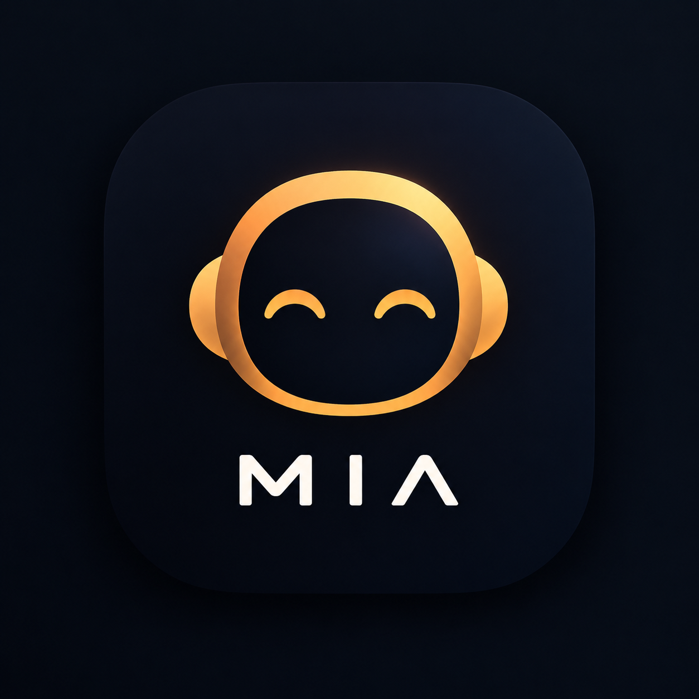

# 🤖 MIA — Minha Inteligência Artificial

### Uma assistente virtual criada para explorar o futuro da inteligência artificial.

[🌐 Acessar a MIA](https://mia-deploy.vercel.app/)

---

## 🧠 Sobre a MIA

A **MIA (Minha Inteligência Artificial)** é um projeto de assistente virtual desenvolvido para apresentar uma experiência moderna de interação com inteligência artificial.

O projeto possui uma interface inspirada em plataformas modernas de IA, permitindo ao usuário conversar com a assistente, organizar conversas e explorar diferentes funcionalidades.

> ⚠️ **Importante:** a MIA atualmente é um **modelo inicial e demonstrativo**. A inteligência artificial ainda está em desenvolvimento e, nesta versão, pode não fornecer respostas completas, precisas ou consistentes para todas as perguntas.

O objetivo desta versão é principalmente apresentar o **conceito, a interface e a estrutura do projeto**, servindo como base para futuras melhorias.

---

## ✨ Funcionalidades

- 💬 Interface de conversa com IA
- 🗂️ Organização de conversas
- 🔐 Sistema de autenticação
- 👤 Gerenciamento de usuários
- 🎨 Interface moderna e responsiva
- 🤖 Integração com modelo de inteligência artificial
- 📱 Compatibilidade com dispositivos móveis
- 💻 Interface adaptada para computador

---

## 🚧 Status do projeto

**🟡 Modelo inicial / Em desenvolvimento**

A estrutura principal da MIA já está funcionando, porém a parte de inteligência artificial ainda está em evolução.

Atualmente, o modelo pode apresentar:

- Respostas incompletas;
- Respostas inconsistentes;
- Limitações na compreensão de algumas perguntas;
- Funcionalidades ainda em desenvolvimento.

Novas versões poderão melhorar progressivamente essas limitações.

---

## 🛠️ Tecnologias

### Front-end
- React
- Vite
- JavaScript
- CSS

### Back-end
- Python
- FastAPI
- SQLAlchemy

### Banco de dados
- PostgreSQL
- Supabase

### Inteligência Artificial
- Google Gemini API

### Deploy
- Vercel
- Render

---

## 🎯 Objetivo

A MIA foi criada como um projeto para explorar o desenvolvimento de uma plataforma própria de inteligência artificial, desde a interface do usuário até o back-end e a integração com modelos de IA.

A versão atual representa o **ponto inicial do projeto**, que poderá receber novas funcionalidades e melhorias no futuro.

---

## 📸 Interface

---

## 👨‍💻 Desenvolvimento

Projeto desenvolvido por **Davi Santos**.

A MIA é um projeto experimental desenvolvido com o objetivo de estudar e explorar tecnologias relacionadas a **inteligência artificial, desenvolvimento web e integração entre front-end e back-end**.

---

### 🤖 MIA
**Um pequeno começo para uma grande ideia.**

